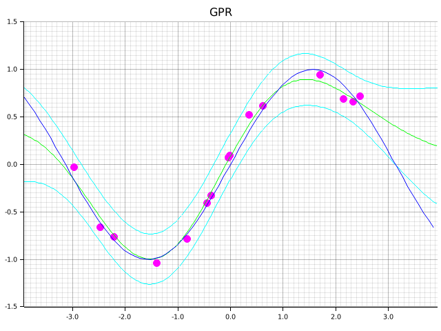

# GPRust
GPRust is a naive implementation of Gaussian Process Regression (GPR) using Rust.


## Demo
```bash
git clone git@github.com:KentaKato/GPRust.git
cd gprust
cargo run
```

After running these commands, GPRust will perform Gaussian Process Regression on a predefined dataset, and the results will be saved as a visual plot.

The regression output is saved in `gprust/images/plot.png`.



## Hyperparameters optimization
The hyperparameters of the kernel function are optimized using grid search and maximum likelihood estimation.
